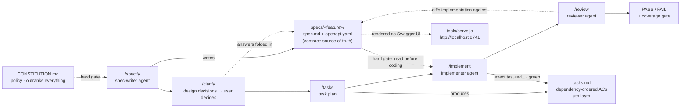
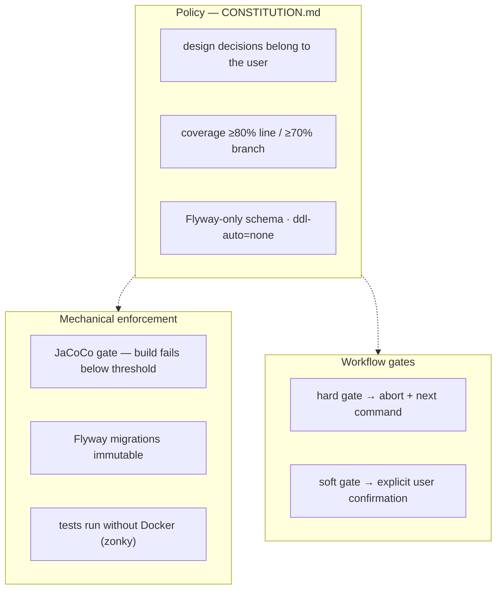

# Star Framework — Flow

## End-to-end pipeline

## Three-layer guard

## The flow in words

1. **`/specify`** — the spec-writer agent turns the idea into `specs/<feature>/spec.md` (user stories, PG data model, validation) + `openapi.yaml` (canonical API contract). Design areas it can't resolve are asked, never guessed.
2. **`/clarify`** — targeted questions (≤5, options + recommendation) resolve remaining design ambiguity; answers are folded back into the spec. Unresolved items stay in "Open questions".
3. **`/tasks`** — the plan: dependency-ordered tasks with acceptance criteria (test cases) per layer, top-down (API first) or bottom-up (persistence first).
4. **`/implement`** — executes the tasks: AC tests first (red), minimal code (green), layer by layer; integration tests are close-to-e2e (`@SpringBootTest` random port + zonky embedded PG + REST Assured, mocks only at the external boundary); ends with the coverage gate (`./mvnw verify`).
5. **`/review`** — diffs the implementation against the spec (contract drift, schema drift, test quality, plan coverage), runs the gate, reports **PASS/FAIL** with findings.

Every phase is gated: hard-gate failures abort with the next suggested command (missing constitution → `star-constitution: init`); soft gates pause for explicit confirmation. The constitution outranks everything; the build enforces mechanically; the agents execute.
