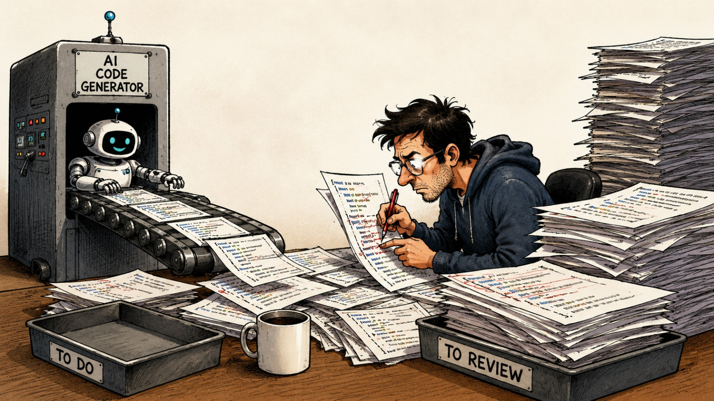

## Survey (1/2)

How often does AI output miss your expectations, forcing you to repeatedly fix it?

## Survey (2/2)

Be honest – do you actually read every line of AI-generated code before merging?

## The Vibe Coding Flow

{width=100% height=200px}

Three fundamental flaws in the typical AI coding workflow:

* *Unpredictable output​* – quality depends on prompt luck
* *Blind Trust​* – "it runs" replaces "it's correct"
* *Non-reusable sessions​* – knowledge trapped in chat history

## Problem 1: Intention Drift

:::: {.columns}

::: {.column width="50%"}
**Problem**: AI output diverges from your intent from the start or over time—in requirements, architecture, or implementation. Requires constant "no" corrections.
:::

::: {.column width="50%"}
**Examples**:
```
- "no, put it in this repo. the ref repo is for ref only"
- "nono, we should use same tech stack as gallery. why you're introducing other lib"
- "no, I want a diagram showing how encryption works. like how the key is transformed. use plantuml to"
- "no, don't save into cryptowl repo. just save it here"
- "no, still no tool is showing, and no <tool text found. check your prompt and model settings"
```
:::

::::

## Problem 2: Blind Trust
**Problem**:​ AI writes both code and tests, acting as player and referee. Humans rarely review line by line, so logical bugs pass through despite green tests.

{width=100%}

## Problem 3: Knowledge Silos

**Problem**:​ Non-reusable sessions – chat history is ephemeral, cannot be shared as team assets.
 
{width=100%}


## These Aren't New Problems

Before AI, we already knew how to build reliable software:

* *Design first*​ – Write a spec before coding. Ensures architecture and intent are correct upfront.
* *Test-driven development*​ – Write tests before implementation. Ensures code correctness through automated verification.
* *Documentation as code*​ – Keep knowledge in version-controlled files. Self-explanatory, reusable, and shareable across the team.

## Spec-Driven Development

Spec-driven development means writing a “spec” before writing code with AI (“documentation first”). The spec becomes the source of truth for the human and the AI.

* *Spec-first*: A well thought-out spec is written first, and then used in the AI-assisted development workflow for the task at hand.
* *Spec-anchored*: The spec is kept even after the task is complete, to continue using it for evolution and maintenance of the respective feature.
* *Spec-as-source*: The spec is the main source file over time, and only the spec is edited by the human, the human never touches the code.

## Contract-First API Development

Contract-First​ applies SDD principles to RESTful API design. When designing RESTful APIs, the API schema (OpenAPI) is a key deliverable of the SDD spec​ — it captures the service contract in a machine-readable format alongside intent, acceptance criteria, and business logic. Defining the schema first ensures the communication layer is precise and testable, while the spec remains the holistic source of truth.

## Test-Driven Development

Test-Driven Development (TDD) is a technique for building software that guides software development by writing tests. 

## The Integrated Workflow


