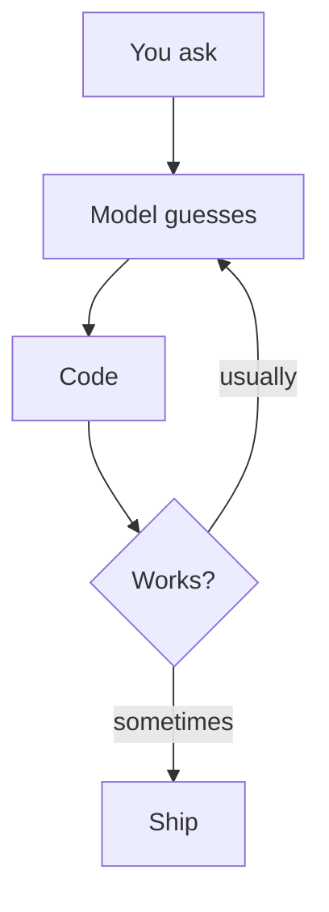
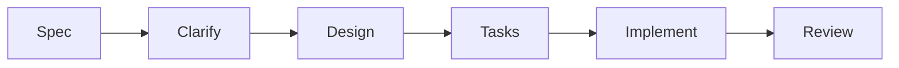
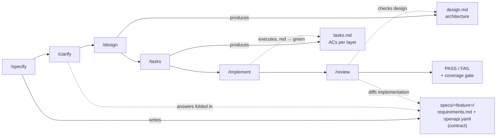
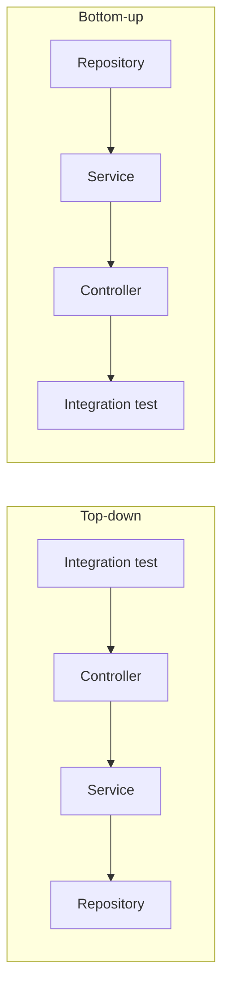

# Star Framework

Spec-Driven Development + TDD for Spring Boot + PostgreSQL, **delivered by GitHub Copilot**

15 minutes · the idea first, then a 5-minute recorded demo

<!--
Setup: no live coding today. Two parts: why the process, then watch the process run.
-->

---
layout: two-cols
---

# The problem

AI coding without a process

- Every prompt is a lottery — "write me a REST API" gives a different result each time
- Contract drift: code says X, docs say Y, nobody notices until integration
- No plan, no test-first, no review — "it compiles" passes for done

::right::

# The gap



The model is smart. The **process around it** is missing.

<!--
The model is smart; the process around it is missing. That's the gap this framework fills.
-->

---

# The idea

## Turn AI delivery into an engineering pipeline



| Phase | Output | Owner |
| ----- | ------ | ----- |
| **Spec** | `requirements.md` + `openapi.yaml` — stories, ACs, contract, data model | spec-writer agent |
| **Clarify** | design decisions + acceptance criteria, folded back into the spec | user decides |
| **Design** | `design.md` — architecture, layering, key decisions | designer agent |
| **Tasks** | `tasks.md` — ACs per layer, top-down or bottom-up | implementer agent |
| **Implement** | failing tests → code → green, layer by layer | implementer agent |
| **Review** | PASS/FAIL verdict vs the spec | reviewer agent |

<!--
The spec is the contract between phases. The user is the design authority. The build is the enforcement.
-->

---

# The full flow



Every phase is gated: hard-gate failures abort with the next command; soft gates ask. The constitution outranks everything.

<!--
The whole framework on one slide — every slide that follows zooms into one piece of this diagram.
-->

---

# Spec is the source of truth

## One directory per feature

```text
specs/orders/
├── requirements.md  # stories · acceptance criteria · PG data model · validation
├── openapi.yaml     # canonical API contract — OpenAPI 3.1
├── design.md        # architecture — after /design
└── tasks.md         # implementation plan — after /tasks
```

- Acceptance criteria (Given/When/Then) live with the stories in `requirements.md`
- Implementation is tested **against** the contract and reviewed **against** it
- Contract change? Update the spec **first**, never the code first
- Browser-viewable: `node .github/tools/serve.js` → Swagger UI renders every feature

```yaml
# openapi.yaml (excerpt)
paths:
  /orders/{id}:
    get:
      responses:
        '200': { $ref: '#/components/schemas/Order' }
        '404': { $ref: '#/components/responses/NotFound' }
```

<!--
The spec is not documentation — it's the executable contract. Tests are written against it, and the reviewer checks the code against it.
-->

---

# Design decisions belong to the user

- **`/clarify`** — targeted questions, at most 5 per round, each with concrete options and a recommendation
- Ambiguity → **ask**. Unresolved → the spec's "Open questions", never a silent assumption
- The agent proposes; the **user decides**

```text
Q: When an order is cancelled, what happens to its items?
a) Keep items, mark order cancelled (recommended)
b) Delete items with the order
c) Keep items, mark them cancelled too
```

Same discipline downstream: the implementer never "fixes" an ambiguity in code — it stops, asks, and updates the spec first.

<!--
This is the one rule that keeps humans in control of the product while the AI does the engineering.
-->

---

# Design then tasks, then TDD

- `/design` — the architecture first: `design.md` (components, layering, key decisions)
- `tasks.md` — dependency-ordered tasks, **acceptance criteria (test cases) per layer**, derived from the spec's ACs
- Two directions, chosen per feature:



- **Top-down** (default): the API contract anchors everything — integration test first, layers descend
- **Bottom-up**: the data model is the hard part — persistence first, API last

Every task: red → green. The suite stays green at every step.

<!--
Coverage is a consequence of the ACs, not a separate activity.
-->

---

# Three-layer guard

| Layer | Role | Example |
| ----- | ---- | ------- |
| **Constitution** | policy, outranks everything | coverage ≥80/70 · Flyway-only schema · never guess design |
| **Build** | mechanical enforcement | JaCoCo gate fails the build · `ddl-auto=none` |
| **Agents** | workflow gates | missing constitution → abort + `star-constitution: init` · pending decisions → `/clarify` · red baseline → fix first |

- **Hard gates** abort and suggest the next command
- **Soft gates** pause for explicit confirmation (e.g. the task plan)

A feature is done when its review passes **and** the coverage gate passes — enforced, not requested.

<!--
Policy without mechanical enforcement is just a wish. That's why the build is part of the guard.
-->

---

# It's a template

```bash
cp -r template/. /path/to/consumer-project/
```

- **4 agents** — spec-writer, designer, implementer, reviewer
- **11 skills** — write-spec, clarify, write-design, task-split, tdd-cycle, integration-test, coverage, endpoint-scaffold, flyway-migration, pg-schema, constitution
- **6 commands** — `/specify` `/clarify` `/design` `/tasks` `/implement` `/review`

Auto-loaded every session: the consumer instructions file (`.github/copilot-instructions.md`) pins the constitution and specs as mandatory context.

Tests without Docker: **zonky embedded PostgreSQL** + REST Assured on a real random-port server.

<!--
One copy-paste installs the whole workflow — repo-level or personal (~/.github).
-->

---

# What the demo shows

5 minutes, pre-recorded, no live coding:

1. **Install** — template into a scratch project, constitution inited
2. **`/specify`** — feature description → `requirements.md` + `openapi.yaml` (2 design questions asked)
3. **Viewer** — the contract rendered as Swagger UI in the browser
4. **`/design`** — the architecture appears in `design.md`
5. **`/tasks`** — the implementation plan with per-layer ACs
6. **`/implement`** — integration test first (red) → controller → service → repository + migration → **green**
7. **`/review`** — PASS verdict, findings, coverage gate output

<video controls :src="'/demo/feature-demo.mp4'"></video>

<!--
:src (dynamic binding) avoids a Vite build error when the file does not exist yet.
Record the demo, save it to doc/public/demo/feature-demo.mp4, and it plays here automatically.
-->

---

# Design decisions worth stealing

- **Gates** — every phase fails fast and tells you the next command
- **Close-to-e2e tests** — `@SpringBootTest` random port + zonky + REST Assured; mocks only at the external boundary
- **Coverage enforced, not requested** — JaCoCo in the build, policy in the constitution
- **Human-in-the-loop** — the AI executes, the user decides

<!--
Each of these is one slide's worth of depth in the repo — steal any of them for your own workflows.
-->

---

# Key takeaways

- AI delivery needs a **process**, not more prompting
- **Spec** = contract · **user** = design authority · **build** = enforcement
- The whole workflow is **one copy-paste** away from any project
- Spec Kit-style SDD, tuned for Spring Boot + PostgreSQL delivery

**→ repo: `drriguz/star-framework`** · slides & demo: `doc/`

<!--
Next steps: dogfood the framework on a real feature, tune the constitution per team, extend the skill set.
-->

---
layout: center
class: text-center
---

# Thank you

Questions?
